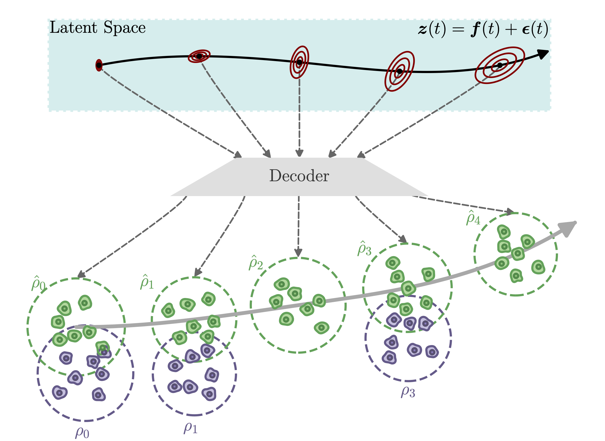

# Latent Gaussian Process with Optimal Transport (LGP-OT)

The official implementation of ICML 2026 paper (poster) [Modeling Temporal scRNA-seq Data with Latent Gaussian Process and Optimal Transport](https://openreview.net/forum?id=8RE5i7g4uB). 



## Abstract
Single-cell RNA sequencing provides insights into gene expression at single-cell resolution, yet inferring temporal processes from these static snapshot measurements remains a fundamental challenge. Current approaches utilizing neural differential equations and flows are sensitive to overfitting and lack careful considerations of biological variability. In this work, we propose a generative framework that models population trends using a latent heteroscedastic Gaussian process (GP) approximated by Hilbert space methods. To address the absence of genuine cell trajectories, we leverage an optimal transport (OT) objective that aligns generated and observed population distributions. Our method explicitly captures biological heterogeneity by incorporating cell-specific latent time and cell type conditioning to disentangle temporal asynchrony and trajectories to different cell types. We demonstrate state-of-the-art performance on complex interpolation and extrapolation benchmarks and introduce a novel gradient-based strategy for inferring perturbation trajectories.

## Requirements

To install requirements:
- Python (>= 3.10)
- [PyTorch](https://pytorch.org) (>= 2.3) and associated dependencies.
- [Anaconda](https://docs.conda.io/projects/conda/en/latest/user-guide/getting-started.html)

basic setup for non-GPU usage:
```setup
conda env create -f environment_basic.yml
```
setup for GPU usage:
```setup
conda env create -f environment_gpu.yml
```

## Datasets Pre-Requirements

First, create a directory to store all datasets

```datadir
mkdir ../data
```
Then, download the datasets from [here](https://doi.org/10.6084/m9.figshare.25601610.v1) and place them in the `../data` directory. The datasets include pre-processed versions of three scRNA-seq datasets: zebrafish embryo, drosophila, and Schiebinger2019. Each dataset contains the raw and pre-processed data, which can be used for training and evaluating the LGP-OT model. 

Run `./data/DrosophilaData_add_CellType.py` to add cell type information to the Drosophila dataset.

Train the model using the following command, where you can specify the dataset and split type:

```
python scripts/LGPOT.py --data_name <dataset_name> --split_type <split_type> --seed <random_seed>
```

Used code bases:
- DGBFGP (Balik et al., 2025): https://github.com/YigitBalik/DGBFGP
- scNODE (Zhang et al., 2024): https://github.com/rsinghlab/scNODE 

References:
1. Balık, M. Y., Sinelnikov, M., Ong, P., & Lähdesmäki, H. (2025, April). Bayesian Basis Function Approximation for Scalable Gaussian Process Priors in Deep Generative Models. In *Forty-second International Conference on Machine Learning*.
2. Zhang, J., Larschan, E., Bigness, J., & Singh, R. (2024). scNODE: generative model for temporal single cell transcriptomic data prediction. *Bioinformatics*, 40, ii146-ii154.